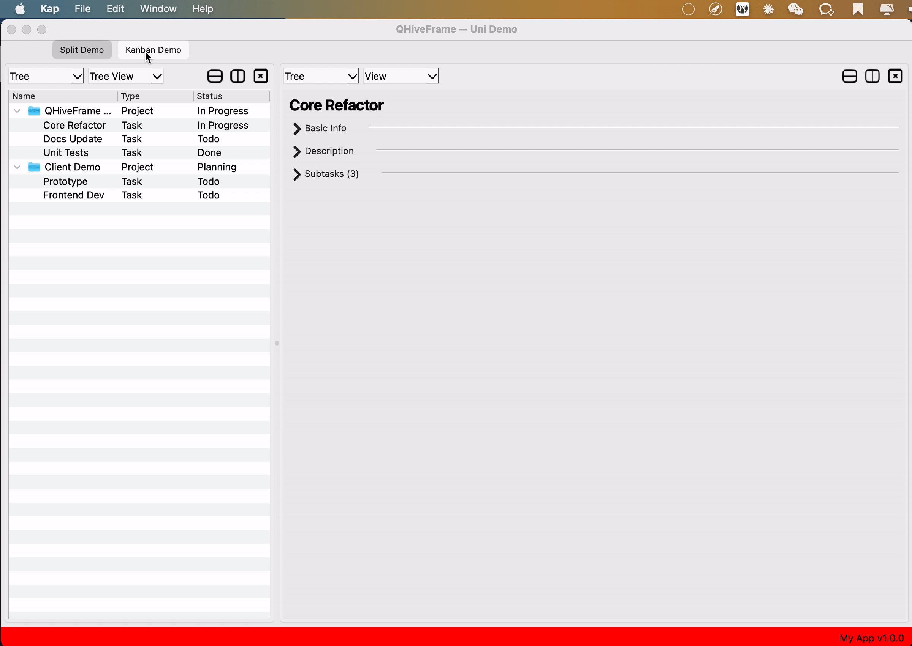

# QHiveFrame

<p align="center">
  🇬🇧 <a href="README.md">English</a> ·
  🇨🇳 <a href="README.zh-CN.md"><b>中文</b></a> ·
  🇩🇪 <a href="README.de-DE.md">Deutsch</a>
</p>

---

一个受 Blender 多工作区 / 多编辑器系统启发的模块化 Qt/C++ GUI 应用框架。

[](LICENSE)


[GitHub: zicowarn/QHiveFrame](https://github.com/zicowarn/QHiveFrame)

---

## 概述

QHiveFrame 提供了一个 **三层级架构** 来构建复杂的多面板桌面应用：

```
Workspace（工作区） → Editor（编辑器） → Mode（模式）
```

该架构深受 Blender 的 Area/Editor 系统启发：一个窗口可以自由分割为多个面板，每个面板运行独立的内容。与 Blender 的 Python/C 混合设计不同，QHiveFrame 完全使用现代 C++ 编写，并提供了 **基于注册的插件系统**，你可以在不修改框架核心代码的情况下扩展每一层级。

### 框架 vs 应用

QHiveFrame 是 **纯框架层**——它提供 UI 基础设施，不捆绑任何业务编辑器、工具或渲染引擎。适用于以下场景的基础：

- 3D/CAD/CAE 编辑器
- 游戏关卡编辑器
- 媒体制作工具
- 数据分析工作站
- 任何需要灵活多视口布局的桌面应用

---

## 核心特性

### 1. 三层级架构（Workspace → Editor → Mode）

| 层级 | 基类 | 职责 |
|------|------|------|
| **工作区** | `QHFWorkspaceBase` | 顶层容器，支持分割布局，管理 Editor 生命周期 |
| **编辑器** | `QHFEditorBase` | 中间层面板，包含 Header + 可滚动内容区，管理 Mode 切换 |
| **模式** | `QHFModeBase` | 内容提供者，提供生命周期钩子（initialize/cleanup/update） |

这套分层的粒度经过仔细权衡：**Workspace 管布局，Editor 管面板切换，Mode 管内容**。它在灵活性和可理解性之间取得了平衡——既足以表达复杂的多面板场景，又不至于过度抽象到让人困惑。

相比 Qt 自身 `QDockWidget` 的笨重动态布局和 `QMdiArea` 的局限，这套设计更像是 **Blender Area 系统在 C++ 中的实现**。

### 2. 灵活的分割布局

- 任意嵌套水平/垂直分割器
- 动态新增/移除/分割编辑器面板
- 活动节点跟踪
- 支持全量重建和增量刷新

### 3. 双事件系统

| 系统 | 适用场景 |
|------|---------|
| **`QHFGuiEventBus`** | 轻量级全局事件（发射即忘，无数据载荷） |
| **`QHFNotifierCenter`** | 丰富通知，带类型化事件和键值数据载荷 |

将两者分离避免了单一事件系统要么不够用要么过度设计的尴尬。两者底层均使用 Qt Signal/Slot，线程安全。

### 4. 基于注册的插件系统

这是真正的**开放-封闭原则**实践——框架对扩展开放，对修改封闭：

```cpp
QHF_REGISTER_EDITOR(MyEditor, EditorType::MY_TYPE);
QHF_REGISTER_WORKSPACE(QHFWorkspaceType::MY_WORKSPACE, MyWorkspace, 1000);
QHF_REGISTER_MENU("Tools", HToolsMenu, 500);
QHF_REGISTER_PANEL("Advanced", HAdvancedPanel, 300);
```

无需手写胶水代码，无需修改框架源码——通过宏 + Registry 模式实现编译期自动发现。

### 5. 偏好设置版本迁移

长期项目一定会遇到配置结构变更。`QHFPreferencesManager` 用声明式规则解决这个问题：

- **`RenameKeyRule`** — 重命名或迁移配置键（支持跨类别）
- **`ConvertValueRule`** — 转换旧值到新格式
- **`RemoveKeyRule`** — 删除过期配置
- **`CustomRule`** — 通过 lambda 实现任意迁移逻辑

```cpp
QHFPreferencesManager::instance().addMigrationRule(
    SemanticVersion(1, 0, 0),
    std::make_unique<RenameKeyRule>("display/lastDir", "file/directory")
);
```

### 6. 内置主题系统

| 主题 | 说明 |
|------|------|
| `LIGHT` | 明亮，传统桌面风格 |
| `DARK` | 深色模式，护眼 |
| `OCEAN` | 蓝色调浅色主题 |
| `SUNNY` | 暖黄色调主题 |

每个主题定义：背景、文字、边框、面板、按钮、下拉框、滚动区、标签栏和菜单的颜色 + 字体 + 圆角半径。
`QHFThemedCRTP<T>` CRTP 混入类会自动将当前主题应用到任何继承它的控件。

### 7. 状态持久化

- **`QHFStateManager`**：窗口几何信息、文件状态、语言、收藏夹目录
- **`QHFPreferencesManager`**：基于 JSON 的层级化设置，支持版本迁移
- 基于语义化版本号触发迁移

### 8. 国际化 / 本地化

- 内置 Qt `.ts`/`.qm` 翻译文件
- 简体中文（zh_CN）和英语（en_US）
- `QHF_DECLARE_NAMESPACE_TR(context)` 宏支持命名空间级别的翻译

### 9. 自定义 UI 控件

- `QHFCollapsibleSection` — 可折叠分组框
- `QHFCustomDragDropTreeView` — 支持内部拖放的树视图
- `QHFCustomUnitSpinBox` — 单位感知的数值输入框
- `QHFCustomActionWidgetBase` — 自定义菜单/工具栏操作控件
- `QHFFileDialog` — 可复用的文件打开/保存对话框

---

## 依赖

| 依赖 | 版本 | 必需 |
|------|------|------|
| Qt | 5.15+ | 是 |
| C++ 编译器 | C++17 | 是 |
| Doxygen | 任意 | 否（仅文档） |

---

## 构建

```bash
# 克隆仓库
git clone https://github.com/zicowarn/QHiveFrame.git
cd QHiveFrame

# 配置并构建（静态库）
cmake -B build -DCMAKE_BUILD_TYPE=Release
cmake --build build

# 或作为动态库
cmake -B build -DCMAKE_BUILD_TYPE=Release -DBUILD_SHARED_LIBS=ON
cmake --build build

# 生成文档
cmake -B build -DBUILD_DOCS=ON
cmake --build --preset docs  # 打开 build/docs/html/index.html
```

### 通过 CMake Presets 构建

**共享预设**（`CMakePresets.json` — 提交到版本库）：

```bash
# 列出所有预设
cmake --list-presets

# Debug 构建
cmake --preset debug
cmake --build --preset debug

# Release 构建
cmake --preset release
cmake --build --preset release

# 测试构建（含单元测试）
cmake --preset test
cmake --build --preset test
cd build/test && ctest -V
```

**用户本地预设**（`CMakeUserPresets.json` — 被 .gitignore 忽略）：

Qt5_DIR 等第三方依赖路径因机器而异，不在共享预设中硬编码。
从模板创建本地预设：

```bash
cp CMakeUserPresets.json.example CMakeUserPresets.json
# 编辑 CMakeUserPresets.json 中的 Qt5_DIR 等路径，然后：
cmake --preset <你的预设名>
```

macOS Homebrew 安装 Qt5 5.15 的快速配置：

```bash
cp CMakeUserPresets.json.example CMakeUserPresets.json
# mac-brew 预设已预配好路径
cmake --preset mac-brew
cmake --build --preset mac-brew
```

### 集成到你的项目

```cmake
# 在你的 CMakeLists.txt 中
find_package(QHiveFrame REQUIRED)
target_link_libraries(your_target PRIVATE QHiveFrame::QHiveFrame)
```

---

## 示例

[`examples/uni-demo/`](examples/uni-demo/) 目录下提供了一个**统一演示程序**：

```bash
# 构建（含示例）
cmake --preset debug -DBUILD_EXAMPLES=ON
cmake --build --preset debug
./build/debug/bin/uni-demo
```

该演示展示了框架的主要功能：
- **分屏工作区** — 多个编辑器面板，支持分割/关闭操作
- **多编辑器切换** — 树形、详情、看板三种面板
- **多模式切换** — 每个编辑器支持模式感知的内容切换
- **可折叠区块** — 展开/折叠内容面板
- **看板布局** — 无拖拽的列式卡片分组
- **自定义控件** — CollapsibleSection、主题表单控件
- **Editor/Mode 注册** — 通过 Factory 注册完成完整装配

---

## 截图

截图存储在 [`screenshots/`](screenshots/) 目录中，通过以下方式引用：



---

## 架构图

```
┌─────────────────────────────────────────────────────┐
│                 QHFAppMainWindow                       │
│  ┌───────────────────────────────────────────────┐  │
│  │  QHFAppHeader（全局菜单栏 + 头部）               │  │
│  ├───────────────────────────────────────────────┤  │
│  │  HWorkspaceContainer（QStackedWidget）         │  │
│  │  ┌─────────────────────────────────────────┐  │  │
│  │  │  QHFWorkspaceBase（分割布局）               │  │  │
│  │  │  ┌──────────────┬──────────────────┐    │  │  │
│  │  │  │  QHFEditorBase  │  QHFEditorBase      │    │  │  │
│  │  │  │  ┌────────┐   │  ┌────────┐      │    │  │  │
│  │  │  │  │ Header │   │  │ Header │      │    │  │  │
│  │  │  │  ├────────┤   │  ├────────┤      │    │  │  │
│  │  │  │  │  Mode  │   │  │  Mode  │      │    │  │  │
│  │  │  │  └────────┘   │  └────────┘      │    │  │  │
│  │  │  └──────────────┴──────────────────┘    │  │  │
│  │  └─────────────────────────────────────────┘  │  │
│  ├───────────────────────────────────────────────┤  │
│  │  QHFAppStatusBar                                │  │
│  └───────────────────────────────────────────────┘  │
└─────────────────────────────────────────────────────┘
```

### 事件流

```
用户操作 → QHFNotifierCenter::publish()
                │
                ├─→ QHFWorkspaceBase::handleNotify()  （布局管理）
                ├─→ QHFEditorBase::handleNotify()     （模式切换）
                ├─→ QHFModeBase::handleNotify()       （内容更新）
                └─→ QHFAppMainWindow::handleNotify()  （文件操作、全屏等）
```

---

## 快速上手

框架附带简单的 Dummy 实现来演示如何串联各层：

- `QHFDummyEditor` — 基础编辑器，带占位模式
- `QHFModeDummyDefault` / `QHFModeDummyTabbed` — 示例模式实现
- `QHFDummyWorkspace` — 带分割面板布局的示例工作区
- `QHFFileMenu` / `QHFEditMenu` / `QHFViewMenu` / `QHFHelpMenu` — 预置菜单模板

要构建真实应用，继承基类并通过提供的宏注册即可。

---

## 项目结构

```
QHiveFrame/
├── core/              # 框架核心（58 个文件）
│   ├── QHFWorkspaceBase.h      # 工作区基类 + LayoutNode
│   ├── QHFEditorBase.h         # 编辑器基类
│   ├── QHFModeBase.h           # 模式基类
│   ├── QHFGuiEventBus.h        # 轻量级事件总线
│   ├── QHFGuiNotifierCenter.h  # 丰富通知系统
│   ├── QHFThemeManager.h       # 主题管理（4 套主题）
│   ├── QHFStateManager.h       # 状态持久化
│   ├── QHFPreferencesManager.h # 偏好设置 + 版本迁移
│   ├── QHFMenuFactory.h        # 菜单注册系统
│   ├── QHFEditorFactory.h      # 编辑器注册
│   ├── QHFModeFactory.h        # 模式注册
│   ├── QHFWorkspaceFactory.h   # 工作区注册
│   └── ...                   # 控件、工具类、对话框
├── dialog/            # 可复用的对话框
├── menu/              # 预置菜单实现
├── workspace/         # 工作区示例
├── subeditor/         # 编辑器示例
├── subeditormode/     # 模式示例
├── preferencepanel/   # 偏好设置面板框架
├── customwidget/      # 自定义 Qt 控件集
├── icons/             # SVG 图标资源
├── locals/            # 国际化翻译文件（zh_CN, en_US）
├── CMakeLists.txt     # 构建配置
├── CMakePresets.json  # CMake presets
├── LICENSE            # MIT 许可证
└── README.md          # 本文档
```

---

## 参与贡献

欢迎提交 PR！提交前请使用 [`.clang-format`](.clang-format) 统一代码风格：

```bash
# 安装 clang-format（如未安装）
# macOS: brew install clang-format
# Linux: apt install clang-format
# Windows: LLVM 工具链自带，或通过 VS 扩展安装

# 提交前格式化所有源文件
find . \( -name '*.cpp' -o -name '*.h' \) -exec clang-format -i -style=file {} +
```

核心风格约定：
- **Allman 大括号** — 大括号独立一行
- **4 空格缩进** — 不使用制表符
- **100 字符列宽**
- **Qt 风格指针** — `int* ptr`
- **自动排序 include** — 自有头 → Qt 头 → 系统头

## 许可证

本项目使用 MIT 许可证发布，详见 [LICENSE](LICENSE) 文件。
